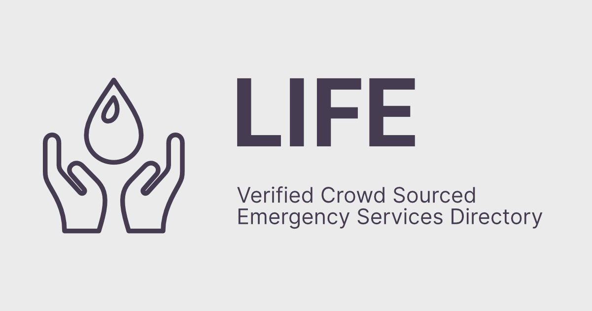

# Life | Coronasafe Network



A database and API for life-fe

## API V2 
 
| Data                              | URL                                                                             |
| --------------------------------- | ------------------------------------------------------------------------------- |
| List of districts with Data       | <https://life-api.coronasafe.network/data/active_district_data_v2.json>         |
| Ambulance availability            | <https://life-api.coronasafe.network/data/ambulance_v2.json>                       |
| Helpline Numbers                  | <https://life-api.coronasafe.network/data/helpline_v2.json>                        |
| Hospitals and Beds                | <https://life-api.coronasafe.network/data/hospital_v2.json>          |
| Medicine availability             | <https://life-api.coronasafe.network/data/medicine_v2.json>                        |
| Oxygen availability               | <https://life-api.coronasafe.network/data/oxygen_v2.json>                          |
| Food availability               | <https://life-api.coronasafe.network/data/food_v2.json>                          |

## API V2 CSV 
 
| Data                              | URL                                                                             |
| --------------------------------- | ------------------------------------------------------------------------------- |
| Ambulance availability            | <https://life_data.coronasafe.network/ambulance.csv>                       |
| Helpline Numbers                  | <https://life_data.coronasafe.network/helpline.csv>                        |
| Hospitals and Beds                | <https://life_data.coronasafe.network/hospital.csv>          |
| Medicine availability             | <https://life_data.coronasafe.network/medicine.csv>                        |
| Oxygen availability               | <https://life_data.coronasafe.network/oxygen.csv>                         |
| Food availability                 | <https://life_data.coronasafe.network/food.csv>                         |


## API V1 (deprecated)
 
| Data                              | URL                                                                             |
| --------------------------------- | ------------------------------------------------------------------------------- |
| List of districts with Data       | <https://life-api.coronasafe.network/data/active_district_data.json>            |
| Ambulance availability            | <https://life-api.coronasafe.network/data/ambulance.json>                       |
| Ambulance availability (verified) | <https://life-api.coronasafe.network/data/ambulance_verified.json>              |
| Helpline Numbers                  | <https://life-api.coronasafe.network/data/helpline.json>                        |
| Helpline Numbers (verified)       | <https://life-api.coronasafe.network/data/helpline_verified.json>               |
| Hospitals and Beds                | <https://life-api.coronasafe.network/data/hospital_clinic_centre.json>          |
| Hospitals and Beds (verified)     | <https://life-api.coronasafe.network/data/hospital_clinic_centre_verified.json> |
| Medicine availability             | <https://life-api.coronasafe.network/data/medicine.json>                        |
| Medicine availability (verified)  | <https://life-api.coronasafe.network/data/medicine_verified.json>               |
| Oxygen availability               | <https://life-api.coronasafe.network/data/oxygen.json>                          |
| Oxygen availability (verified)    | <https://life-api.coronasafe.network/data/oxygen_verified.json>                 |

## For Non-Developers
 You can make use of this Master Google Sheet: <https://docs.google.com/spreadsheets/d/1Oyuf3LOjBr_ubJOJCTlBk6ODg3jXiSlLMW9g4-m5SHU/edit?usp=sharing>


## Want to help with coding?

-   [Open issues](https://github.com/coronasafe/life/issues)

[](http://slack.coronasafe.in/)

## Source

-   [Covidfyi data store](https://airtable.com/shrIlOoS6PyhIIVEv)

# Contributions Docs

[Detailed Contributing Guide](https://life.coronasafe.network/how_to_contribute)

## Getting Started

First, run the development server:

```
npm install
npm run dev
# or
yarn dev
```

Open http://localhost:3000 with your browser to see the result.

You can start editing the page by modifying pages/index.js. The page auto-updates as you edit the file.

## Adding Translations

[For Adding a New Language](/locales/docs/adding-new-language.md)

For translations of Existing Language:
[Please Refer This](https://github.com/coronasafe/life/issues/109)

Supported by [Swasth Alliance](https://www.swasth.app) | [Vercel](https://vercel.com?utm_source=life&utm_campaign=oss)
